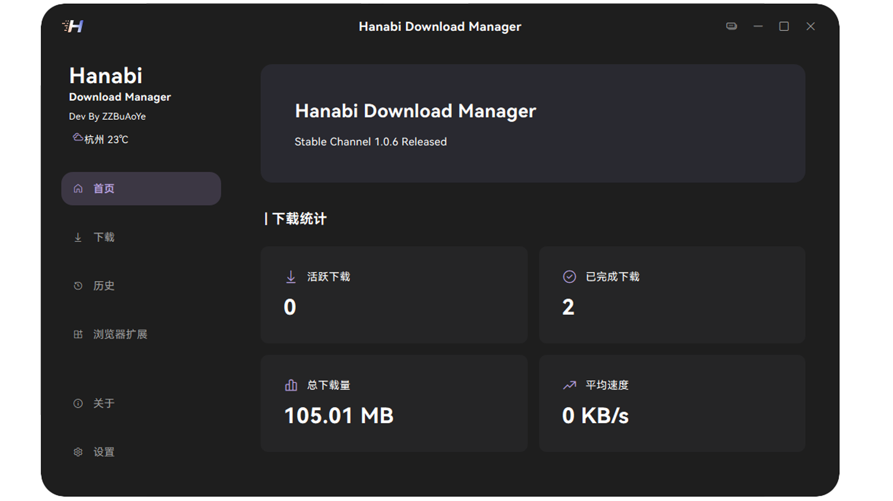

  
## Hanabi Download Manager

<div align="center">


一个高效多线程下载管理器，支持断点续传、智能线程管理和下载限速功能。

[English](./README_EN.md) | 简体中文

</div>


## ✨ 核心特性

- 🚀 **多线程下载**：动态分配线程，最大化下载速度
- 🔄 **断点续传**：支持意外中断后继续下载
- 🧠 **智能线程管理**：根据网络状况自动调整线程数
- ⚡ **下载速度限制**：可自定义下载带宽限制
- 🔌 **代理支持**：支持系统代理或自定义代理

## 📁 项目结构

```
HanabiDownloadManager/
├── core/                    # 核心功能模块
│   ├── animations/         # 动画效果
│   ├── config/            # 配置管理
│   ├── download_core/     # 下载核心实现
│   ├── font/              # 字体资源
│   ├── history/           # 下载历史记录
│   ├── log/               # 日志管理
│   ├── page_manager/      # 页面管理
│   ├── thread/            # 线程管理
│   └── update/            # 更新模块
├── connect/                # 连接管理模块
│   ├── tcp_server.py      # TCP服务器实现
│   ├── websocket_server.py # WebSocket服务器
│   ├── fallback_connector.py # 备用连接器
│   ├── download_manager.py # 下载管理器
│   └── __init__.py
├── client/                 # 客户端模块
│   └── ui/                # 用户界面
├── resources/             # 资源文件
│   ├── logo.png          # 主logo
│   └── logo2.png         # 备用logo
└── hdm_chrome_extension/  # Chrome扩展
    ├── manifest.json     # 扩展配置文件
    ├── background.js     # 后台脚本
    ├── popup.html        # 弹出窗口
    ├── popup.js          # 弹出窗口脚本
    ├── welcome.html      # 欢迎页面
    ├── welcome.js        # 欢迎页面脚本
    ├── HDM_Latest.zip    # 最新版本包
    └── icons/            # 扩展图标
        ├── icon16.png
        ├── icon32.png
        ├── icon48.png
        └── icon128.png
```

## 🛠️ 技术栈

- **开发语言**: Python 3.12.6
- **UI框架**: PySide6
- **HTTP客户端**: Requests
- **打包工具**: Nuitka
- **并发处理**: 线程池
- **文件处理**: 支持稀疏文件创建，预分配文件空间

## 📦 安装

```bash
# 克隆仓库
git clone https://github.com/yourusername/Hanabi-Download-Manager.git

# 进入项目目录
cd Hanabi-Download-Manager

# 安装依赖
pip install -r requirements.txt
```

## 🚀 快速开始

```python
from core.download_core import TransferManager

# 创建下载管理器
transfer = TransferManager(
    url="https://example.com/large-file.zip",
    headers={"User-Agent": "MyDownloader/1.0"},
    maxThreads=8,
    savePath="/downloads",
    dynamicThreads=True
)

# 连接信号
transfer.segmentProgressChanged.connect(on_progress_changed)
transfer.transferSpeedChanged.connect(on_speed_changed)
transfer.downloadComplete.connect(on_download_complete)
transfer.errorOccurred.connect(on_error)

# 开始下载
transfer.start()
```

## 📚 开发者文档

- 查看[开发者文档](./DevDoc.md)了解详细的项目结构
- UI控件样式采用[ClutUI-NG](https://github.com/buaoyezz/ClutUI-Nextgen)

## 🤝 贡献指南

欢迎提交 Pull Request 或创建 Issue！

## 📄 许可证

本项目采用 GPLv3 许可证 - 查看 [LICENSE](LICENSE) 文件了解详情

---

<div align="center">
Made with ❤️ by Hanabi Team
</div>