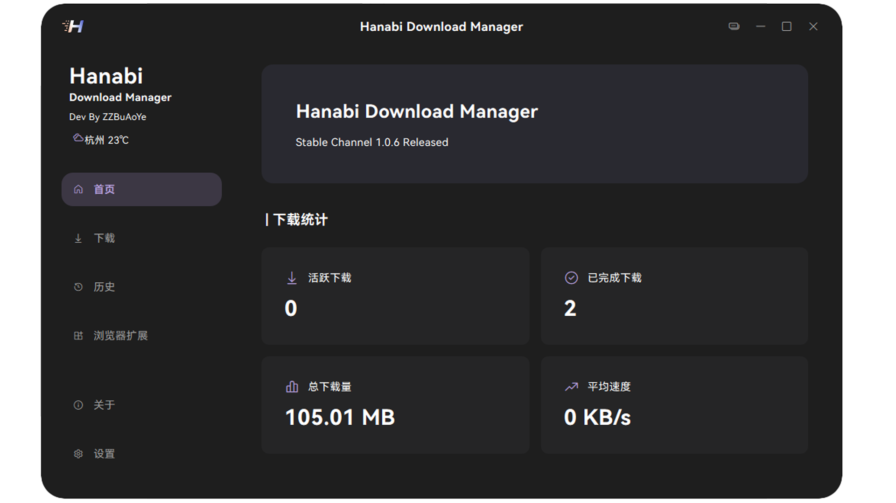

  
## Hanabi Download Manager

<div align="center">


An efficient multi-threaded download manager featuring breakpoint resume, intelligent thread management, and download speed limiting.

[English](./README_EN.md) | [简体中文](./README.md)

</div>


## ✨ Core Features

- 🚀 **Multi-threaded Download**: Dynamically allocate threads to maximize download speed.
- 🔄 **Breakpoint Resume**: Continue downloads after unexpected interruptions.
- 🧠 **Intelligent Thread Management**: Automatically adjust thread count based on network conditions.
- ⚡ **Download Speed Limiting**: Customizable bandwidth limit for downloads.
- 🔌 **Proxy Support**: Supports system or custom proxy.

## 📁 Project Structure
HanabiDownloadManager/
├── core/ # Core modules
│ ├── animations/ # Animation effects
│ ├── config/ # Configuration management
│ ├── download_core/ # Download core implementation
│ ├── font/ # Font resources
│ ├── history/ # Download history
│ ├── log/ # Log management
│ ├── page_manager/ # Page management
│ ├── thread/ # Thread management
│ └── update/ # Update module
├── connect/ # Connection management
│ ├── tcp_server.py # TCP server implementation
│ ├── websocket_server.py # WebSocket server
│ ├── fallback_connector.py # Fallback connector
│ ├── download_manager.py # Download manager
│ └── init.py
├── client/ # Client module
│ └── ui/ # User interface
├── resources/ # Resource files
│ ├── logo.png # Main logo
│ └── logo2.png # Alternative logo
└── hdm_chrome_extension/ # Chrome extension
├── manifest.json # Extension manifest
├── background.js # Background script
├── popup.html # Popup window
├── popup.js # Popup script
├── welcome.html # Welcome page
├── welcome.js # Welcome page script
├── HDM_Latest.zip # Latest version package
└── icons/ # Extension icons
├── icon16.png
├── icon32.png
├── icon48.png
└── icon128.png


## 🛠️ Tech Stack

- **Language**: Python 3.12.6
- **UI Framework**: PySide6
- **HTTP Client**: Requests
- **Packaging Tool**: Nuitka
- **Concurrency**: Thread pool
- **File Handling**: Supports sparse file creation and pre-allocation

## 📦 Installation

```bash
# Clone the repository
git clone https://github.com/yourusername/Hanabi-Download-Manager.git

# Enter the project directory
cd Hanabi-Download-Manager

# Install dependencies
pip install -r requirements.txt
```

## 🚀 Quick Start

```python
from core.download_core import TransferManager

# Create a download manager
transfer = TransferManager(
    url="https://example.com/large-file.zip",
    headers={"User-Agent": "MyDownloader/1.0"},
    maxThreads=8,
    savePath="/downloads",
    dynamicThreads=True
)

# Connect signals
transfer.segmentProgressChanged.connect(on_progress_changed)
transfer.transferSpeedChanged.connect(on_speed_changed)
transfer.downloadComplete.connect(on_download_complete)
transfer.errorOccurred.connect(on_error)

# Start download
transfer.start()
```

## 📚 Developer Docs

- See [DevDoc](./DevDoc.md) for detailed project structure
- UI components styled with [ClutUI-NG](https://github.com/buaoyezz/ClutUI-Nextgen)

## 🤝 Contributing

Pull Requests and Issues are welcome!

## 📄 License

This project is licensed under GPLv3 - see the [LICENSE](LICENSE) file for details

---

<div align="center">
Made with ❤️ by Hanabi Team
</div>